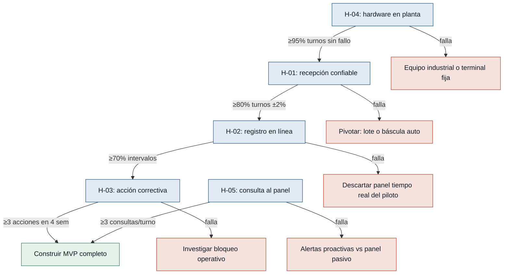

# Hipótesis y experimentos — Control de Rendimiento Pesquero

> Generado por `/discovery:experiments discoveries/rendimientopescado`  
> Fuente de supuestos: `outputs/mvp-canvas.md` · Evidencia: `interviews/recepcion.md`, `interviews/jefe-produccion.md`

Ordenadas de mayor a menor riesgo. Cada hipótesis ataca un salto de fe del MVP antes de construir el sistema completo.

---

### [H-01] Datos confiables en recepción — riesgo: alto

- **Supuesto a probar:** Sin datos de entrada confiables en recepción, el rendimiento calculado sigue siendo incierto aunque exista un panel digital *(recepcion.md)*.
- **Hipótesis:** Creemos que el operador de recepción logrará un total de kg por turno con error ≤2% respecto a una auditoría física si registra cada caja en una tablet conectada a la balanza existente, porque hoy el cuello de botella es la planilla de papel que se pierde o se moja y el traslado tardío a Excel.
- **Señal medible:** Porcentaje de turnos con ingreso donde el total digital de kg coincide con el pesaje de auditoría dentro de ±2%.
- **Criterio de éxito:** ≥80% de los turnos con ingreso en 2 semanas (mínimo 8 turnos auditados).
- **Experimento:** Mago de Oz — tablet con formulario mínimo (peso por caja + total automático) en recepción durante 2 semanas; auditoría cruzada de 1 turno por semana con pesaje independiente de todas las cajas.
- **Caja de tiempo/costo:** 2 semanas · 1 tablet + formulario simple · ~4 h/semana de coordinación del jefe de producción para auditorías.
- **Regla de decisión:** Si pasa → construir R-01, R-02 y R-03 en el MVP; si falla → pivotar a registro por lote (no por caja) o integrar báscula automática antes de escalar el panel de rendimiento.

---

### [H-02] Registro de lomo en línea por supervisores — riesgo: alto

- **Supuesto a probar:** Los supervisores de turno registrarán kilos de lomo en línea con la misma disciplina que hoy llenan la hoja de Excel al cierre *(jefe-produccion.md)*.
- **Hipótesis:** Creemos que en ≥70% de los intervalos de 2 horas de un turno activo habrá registro de kg de lomo si el supervisor usa una captura digital obligatoria en tablet, porque hoy ya completan la hoja de Excel al final del turno aunque sea inconsistente.
- **Señal medible:** Porcentaje de intervalos de 2 horas dentro del turno que tienen al menos un registro de kg de lomo.
- **Criterio de éxito:** ≥70% de intervalos cubiertos en 10 turnos piloto durante 2 semanas.
- **Experimento:** Concierge — formulario digital en tablet en línea de producción (sin panel ni alertas); el jefe de producción revisa cobertura diaria de intervalos.
- **Caja de tiempo/costo:** 2 semanas · 1 tablet en línea · ~2 h/semana de revisión del jefe.
- **Regla de decisión:** Si pasa → incluir registro de lomo en línea como funcionalidad mínima del MVP; si falla → descartar el panel en tiempo real del piloto y limitar el MVP a recepción + reporte de cierre de turno.

---

### [H-03] Acción correctiva durante el turno — riesgo: alto

- **Supuesto a probar:** El jefe de producción actuará sobre el rendimiento durante el turno si dispone del dato a tiempo; hoy esa cifra es **0** acciones correctivas antes del cierre *(jefe-produccion.md, métrica del MVP)*.
- **Hipótesis:** Creemos que el jefe de producción documentará al menos una acción correctiva (ajuste de línea, calidad o corte) antes del cierre del turno si recibe una alerta cuando el ratio lomo/materia prima cae bajo umbral, porque hoy se entera horas después y la corrección ya no es posible.
- **Señal medible:** Número de turnos con al menos una acción correctiva documentada antes del cierre, motivada por alerta o consulta al ratio en tiempo real.
- **Criterio de éxito:** ≥3 turnos en un piloto de 4 semanas (la línea base actual es 0).
- **Experimento:** Mago de Oz — dashboard manual actualizado cada hora con ratio lomo/materia prima + alerta por WhatsApp al jefe cuando el ratio cae bajo umbral acordado; bitácora de acciones correctivas.
- **Caja de tiempo/costo:** 4 semanas · spreadsheet compartido + WhatsApp · ~1 h/día de actualización manual por turno.
- **Regla de decisión:** Si pasa → perseverar con panel y alertas (R-04, R-05) como núcleo del MVP; si falla → pivotar: investigar si el bloqueo es autoridad operativa, umbral mal calibrado o datos no confiables (H-01/H-02) antes de construir software.

---

### [H-04] Hardware resistente en planta — riesgo: medio

- **Supuesto a probar:** La conectividad y el hardware resisten las condiciones de frío y humedad en planta pesquera *(recepcion.md, R-12)*.
- **Hipótesis:** Creemos que el operador de recepción completará el registro digital de un turno completo sin interrupciones por fallo de equipo si usa una tablet con funda protectora en el punto de descarga, porque el dolor actual es el papel que se moja, no la imposibilidad de usar dispositivos en planta.
- **Señal medible:** Porcentaje de turnos con ingreso donde el registro digital se completa sin fallo de hardware o software que impida capturar pesos.
- **Criterio de éxito:** ≥95% de turnos completados sin fallo en 14 turnos consecutivos con ingreso (2 semanas).
- **Experimento:** Smoke test de hardware — tablet con funda en recepción durante 2 semanas de operación real; registro de incidencias por turno.
- **Caja de tiempo/costo:** 2 semanas · 1 tablet + funda (~USD 300–500) · registro de incidencias en planilla.
- **Regla de decisión:** Si pasa → seleccionar ese hardware para el piloto del MVP; si falla → pivotar a terminal fija fuera de zona húmeda o equipo industrial certificado antes del despliegue.

---

### [H-05] Consulta activa al ratio en tiempo real — riesgo: medio

- **Supuesto a probar:** Disponer del ratio de rendimiento en menos de 60 segundos cambia el comportamiento del jefe frente a recibir estimados horas después del cierre *(jefe-produccion.md, R-11)*.
- **Hipótesis:** Creemos que el jefe de producción consultará el ratio lomo/materia prima al menos 3 veces por turno si está disponible en un panel actualizado en menos de 60 segundos, porque hoy espera horas y no puede intervenir mientras el turno sigue activo.
- **Señal medible:** Número promedio de consultas al ratio por turno (registradas en log de acceso).
- **Criterio de éxito:** Media ≥3 consultas por turno en ≥80% de los turnos durante 2 semanas (mínimo 8 turnos).
- **Experimento:** Prototipo desechable — dashboard web con datos actualizados manualmente cada 30 minutos y log de accesos; sin alertas automáticas en esta fase.
- **Caja de tiempo/costo:** 2 semanas · página web estática + hoja de cálculo de backend · ~30 min/turno de actualización manual.
- **Regla de decisión:** Si pasa → invertir en R-04 y R-11 (panel en tiempo real); si falla → replantear si el valor percibido es bajo o si el jefe delega la consulta; considerar empujar alertas proactivas en lugar de panel pasivo.

---

## Árbol de decisión — secuencia recomendada

**Nota:** H-04 puede ejecutarse en paralelo con H-01 (misma tablet en recepción). H-05 se prueba después de validar H-01 y H-02, cuando ya hay datos para alimentar el panel.

**Fuera de alcance del tablero:** el dolor de bodega de producto terminado (stock desactualizado) queda en fase 2 según el MVP Canvas; no bloquea estos experimentos del núcleo de rendimiento.
