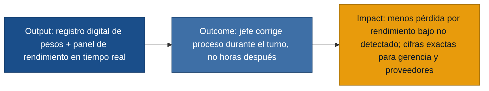

# MVP Canvas — Control de Rendimiento Pesquero

> Generado por `/discovery:generate-mvp discoveries/rendimientopescado`  
> Fuente de evidencia: `interviews/recepcion.md`, `interviews/jefe-produccion.md`, `interviews/bodega-producto-terminado.md`

---

## MVP Canvas — Control de Rendimiento Pesquero

| Bloque | Contenido |
|---|---|
| **Propuesta de valor** | Conectar la recepción de materia prima con el seguimiento de rendimiento en producción mediante registros digitales de peso, para que el jefe de producción conozca el ratio lomo/materia prima **durante el turno** y pueda actuar antes del cierre, con cifras exactas en lugar de estimados. |
| **Segmento de usuarios** | Operador de recepción de materia prima (R.) y jefe de producción (J.) — personas primarias con respaldo de primera mano. Gerencia como beneficiaria indirecta del reporte por turno. |
| **Funcionalidades mínimas** | (1) Registro digital de peso por caja en recepción con total por turno/día. (2) Registro de diferencia peso proveedor vs. peso interno. (3) Panel de rendimiento en tiempo real (kg lomo / kg materia prima). (4) Alerta configurable cuando el rendimiento cae bajo umbral. (5) Reporte consolidado por turno para gerencia. (6) Unidad única: kilogramos. |
| **Resultado esperado (outcome)** | El jefe de producción deja de enterarse del rendimiento horas después del cierre y puede intervenir en calidad de pescado, línea o corte **mientras el turno sigue activo**. La recepción deja de entregar estimados y puede demostrar diferencias con proveedores. |
| **Métrica de éxito** | En un piloto de 4 semanas, al menos **3 turnos** donde el jefe de producción registra una **acción correctiva documentada** (ajuste de línea, calidad o corte) **antes del cierre**, motivada por una alerta o consulta al panel de rendimiento en tiempo real. Hoy esa cifra es **0**: el dato llega tarde y la corrección ya no es posible *(jefe-produccion.md)*. Si sube, gerencia puede confiar en que el sistema cambia comportamiento operativo, no solo digitaliza papeles. |
| **Riesgos / supuestos** | **Supuesto:** los supervisores de turno registrarán kilos de lomo en línea con la misma disciplina que hoy llenan la hoja de Excel *(jefe-produccion.md)*. **Supuesto:** la conectividad y el hardware resisten frío/humedad en planta *(recepcion.md)*. **Riesgo:** sin datos de entrada confiables en recepción, el rendimiento calculado sigue siendo incierto *(recepcion.md)*. **Riesgo:** bodega de producto terminado sigue operando con Excel hasta una fase 2; no bloquea el piloto de rendimiento pero mantiene el dolor de stock desactualizado *(bodega-producto-terminado.md)*. |
| **Fuera de alcance (por ahora)** | Inventario en tiempo real de bodega de producto terminado (R-06, R-07, R-08): dolor real y evidenciado, pero flujo distinto al núcleo de rendimiento; incluirlo diluiría el MVP. Identificación física de pallets y notificaciones producción→bodega quedan para fase 2 *(bodega-producto-terminado.md)*. Integración con ERP o conciliación automática con proveedores: no hay evidencia de ese requisito en las entrevistas actuales. |

---

## Cadena output → outcome → impact

---

## Trazabilidad requisitos → historias

| Requisito | User story | En MVP |
|-----------|------------|--------|
| R-01 | US-01 | Sí |
| R-02 | US-02 | Sí |
| R-03 | US-03 | Sí |
| R-04 | US-04 | Sí |
| R-05 | US-05 | Sí |
| R-06 | US-07 | No (fase 2) |
| R-07 | US-08 | No (fase 2) |
| R-08 | US-09 | No (fase 2) |
| R-09 | US-06 | Sí |
| R-10 | US-04 (criterio) | Sí |
| R-11 | US-04 (criterio) | Sí |
| R-12 | US-01 (criterio) | Sí |
