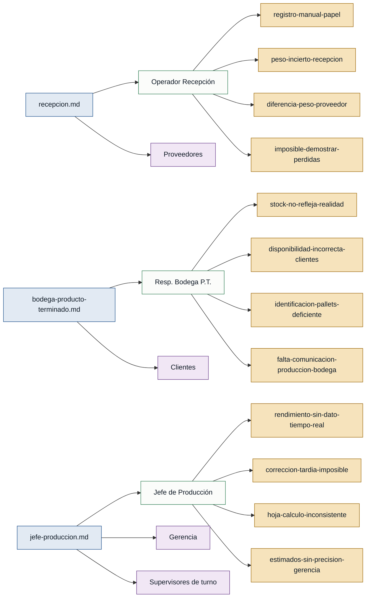

# Personas y Stakeholders — Rendimiento de Pescado

> Generado por `/discovery:analyze discoveries/rendimientopescado`  
> Fuente de evidencia: `interviews/recepcion.md`, `interviews/jefe-produccion.md`, `interviews/bodega-producto-terminado.md`

---

## Personas

### R. — Operador de Recepción de Materia Prima
- **Contexto:** Operario de planta que descarga y pesa las cajas de pescado entrante al llegar cada camión.
- **Objetivo principal:** Registrar con exactitud los kilos de materia prima que ingresan en cada recepción y poder demostrar diferencias frente al proveedor.
- **Dolores:**
  - Registra los pesos caja por caja en planilla de papel; luego alguien los transcribe a Excel, no siempre el mismo día; los papeles se pierden o mojan. *(recepcion.md)*
  - No dispone de un total confiable de kilos ingresados por día: el dato que entrega al jefe de producción es un estimado ("como 8 toneladas"). *(recepcion.md)*
  - Siempre existe una diferencia entre el peso declarado por el proveedor y el peso medido internamente, pero nadie la lleva en limpio ni puede demostrarla. *(recepcion.md)*
  - Cuando el rendimiento sale bajo, es imposible saber si la causa fue la cantidad real ingresada o el proceso; no hay cómo probar nada. *(recepcion.md)*
- **Respaldo:** `primera mano` — entrevista `recepcion.md` (`rol_entrevistado: operador de recepción de materia prima`, `primera_persona: true`).

---

### J. — Jefe de Producción
- **Contexto:** Responsable del proceso productivo (descongelado → procesado → lomo limpio). Toma decisiones sobre calidad y correcciones de línea en tiempo real.
- **Objetivo principal:** Conocer el rendimiento (kilos de lomo / kilos de materia prima) durante el turno para corregir desviaciones antes de que sea tarde.
- **Dolores:**
  - No tiene el dato de rendimiento en tiempo real; debe esperar al cierre de turno (horas de retraso) para recibirlo. *(jefe-produccion.md)*
  - Cuando el rendimiento es bajo y se entera tarde, ya no puede corregir el proceso (calidad de pescado, problema de línea, corte incorrecto de operarios). *(jefe-produccion.md)*
  - La hoja de cálculo la completan distintos supervisores al final del turno con inconsistencias: unidades mixtas (kilos vs. libras), celdas vacías, datos irreconciliables. *(jefe-produccion.md)*
  - Debe rendir cuentas a gerencia con estimados, no con datos exactos, lo que él mismo reconoce como "no serio". *(jefe-produccion.md)*
- **Respaldo:** `primera mano` — entrevista `jefe-produccion.md` (`rol_entrevistado: jefe de producción`, `primera_persona: true`).

---

### B. — Responsable de Bodega de Producto Terminado
- **Contexto:** Encargado de recibir los pallets de lomo empacado que envía producción, registrarlos y gestionar el stock en cámara frigorífica.
- **Objetivo principal:** Mantener un inventario confiable y en tiempo real del stock disponible para poder responder con exactitud a clientes y gestionar despachos urgentes.
- **Dolores:**
  - El Excel de inventario no refleja la realidad: las salidas no se anotan al momento y hay diferencia permanente entre el registro y lo físico. *(bodega-producto-terminado.md)*
  - Ha comprometido stock con clientes que ya había salido por la desactualización del inventario. *(bodega-producto-terminado.md)*
  - Los pallets no están bien identificados (etiquetas caídas, sin fecha de producción); ante un despacho urgente debe entrar a la cámara frigorífica a revisar físicamente uno por uno. *(bodega-producto-terminado.md)*
  - Producción no le avisa cuándo va a ingresar producto nuevo; todo es reactivo y no puede planificar espacio ni carga de trabajo. *(bodega-producto-terminado.md)*
- **Respaldo:** `primera mano` — entrevista `bodega-producto-terminado.md` (`rol_entrevistado: responsable de bodega de producto terminado`, `primera_persona: true`).

---

## Stakeholders

### Gerencia
- **Interés en el sistema:** Recibir cifras exactas de rendimiento y producción para tomar decisiones de negocio; actualmente solo recibe estimados. *(jefe-produccion.md)*
- **Fuente:** `jefe-produccion.md`

### Clientes
- **Interés en el sistema:** Obtener información confiable y actualizada sobre disponibilidad de stock antes de confirmar pedidos o despachos urgentes. *(bodega-producto-terminado.md)*
- **Fuente:** `bodega-producto-terminado.md`

### Proveedores de materia prima
- **Interés en el sistema:** Que los pesos recibidos queden registrados con exactitud para poder conciliar diferencias con la empresa. *(recepcion.md)*
- **Fuente:** `recepcion.md`

### Supervisores de turno
- **Interés en el sistema:** Contar con un formulario uniforme y claro para reportar el avance del turno; hoy el proceso es ambiguo (unidades, campos opcionales). *(jefe-produccion.md)*
- **Fuente:** `jefe-produccion.md`

---

## Mapa de trazabilidad

